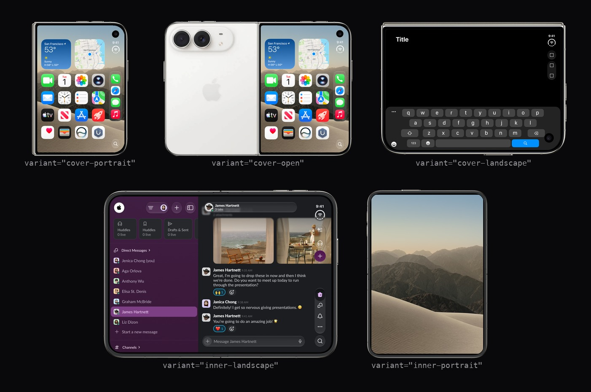

# DuoFrameDisplay



**[See it running →](https://dahlberg.work/demo/DuoFrameDisplay)** — every capability rendered live, with its code beside it. Click any frame to open the shared lightbox.

React components for showing app screenshots and screen recordings inside an iPhone Duo frame — closed, closed-at-an-angle, closed-landscape, unfolded-landscape or unfolded-portrait — with zoom cropping and a shared lightbox. Next.js, Tailwind, shadcn-style copy-paste.

Built the same way as [iPhoneFrameDisplay](https://github.com/mattdahlberg/iPhoneFrameDisplay), adapted for a foldable: the Duo's five frame graphics aren't interchangeable alternates the way iPhone models are — they're the device's five physical states, so `<DuoImage>`/`<DuoVideo>` take a `variant` prop rather than `model`.

- **`<DuoImage>`** — composite a screenshot into a Duo frame
- **`<DuoVideo>`** — same, for a screen recording, lazy-loaded with a generated poster
- **`<ProjectImageGrid>`** — lay several frames out side by side
- **Shared lightbox** — click any of them to open the full, uncropped frame; every instance on the page joins one swipeable gallery

Content shown above is placeholder art — real screenshots/recordings will swap in once the Duo ships.

## Requirements

Next.js (the components use `next/image`), React 19, and Tailwind with shadcn-style CSS variables — they reference tokens such as `bg-muted` and `text-muted-foreground`.

## Install

```bash
npx shadcn@latest add https://raw.githubusercontent.com/mattdahlberg/DuoFrameDisplay/main/public/r/duo-video.json
```

Available items: `duo-image`, `duo-video`, `project-image-grid`, `large-image`, `lightbox-video`, and `page-lightbox` (pulled in automatically by the others).

Then **download the five frame PNGs** from [`public/frames/`](public/frames) into your own `public/frames/`. They aren't installed by the command above — `shadcn` inlines file contents as UTF-8 text, which corrupts binary files.

Prefer to copy by hand? Install the dependencies and copy the source directly:

```bash
npm install photoswipe clsx tailwind-merge
```

Copy `src/components/phone-frame/`, `src/components/ui/video.tsx`, a `cn()` helper, and the frame PNGs.

Wrap the page in the provider, then drop the components in:

```tsx
import { PageLightboxProvider } from '@/components/phone-frame/page-lightbox';
import { DuoImage } from '@/components/phone-frame/duo-image';

<PageLightboxProvider>
  <DuoImage variant="cover-portrait" src="/lock-screen.png" width={200} />
</PageLightboxProvider>
```

## Props

`DuoImage` and `DuoVideo` take the same shape:

| Prop | Default | |
|---|---|---|
| `src` | — | image or video path |
| `caption` | — | lightbox caption, and alt text for `DuoImage` |
| `variant` | `cover-portrait` | which physical state to render - see [Frames](#frames) |
| `width` | `280` | rendered width in px **at `zoom={1}`**; grows with zoom |
| `zoom` | `1` | `1` = whole frame, `2+` crops tighter. Ignored when `focus` is `left`/`right` |
| `focus` | `center` | `top` / `center` / `bottom` crop vertically, paired with `zoom` - no effect at `zoom={1}`. `left` / `right` crop to a fixed 50/50 split of the frame's width instead, ignoring `zoom` entirely - built for the hinge itself, e.g. showing one pane of `inner-landscape`'s split-view layout |

```tsx
<DuoVideo variant="inner-landscape" src="/demo.mp4" width={320} zoom={2} focus="bottom" />
<DuoImage variant="inner-landscape" src="/split-view.png" width={220} focus="left" />
```

`DuoVideo` expects a poster image alongside the video as `<name>-poster.jpg`. Generate them with:

```bash
npm run generate-posters
```

## Frames

| Variant | Display | Orientation |
|---|---|---|
| `cover-portrait` | Outer 5.4" (closed) | Portrait |
| `cover-open` | Outer 5.4" (closed, shown at an angle - other half of the frame is the phone's back panel) | Portrait |
| `cover-landscape` | Outer 5.4" (closed) | Landscape |
| `inner-landscape` | Inner 7.6" (unfolded - one continuous screen, not two) | Landscape |
| `inner-portrait` | Inner 7.6" (unfolded) | Portrait |

`cover-portrait` and `cover-open` share one screen cutout (same size and position, just placed on a wider canvas for the angled shot) - measure once, reuse for both.

**Adding a variant:** drop a PNG with a genuinely transparent screen cutout into `public/frames/`, measure the cutout from its alpha channel, and add an entry to `duo-frame-constants.ts`. Measure with row/column scans near the shape's centre, not a flood fill from the centre pixel outward - on frames this tightly cropped, a flood fill can silently merge the screen region with the transparent background just outside the device. Verify the corner radius by eye against a zoomed crop of the corner too; a script's guess and the visible result can disagree by a lot, especially between a nearly-square cutout and a heavily rounded one.

## Examples

`src/app/page.tsx` is a harness rendering every variant, `DuoVideo`, and `zoom`/`focus`, each with its code beside it. To run it:

```bash
npm install
npm run dev
```

Then open **http://localhost:3002**.

## License

MIT
